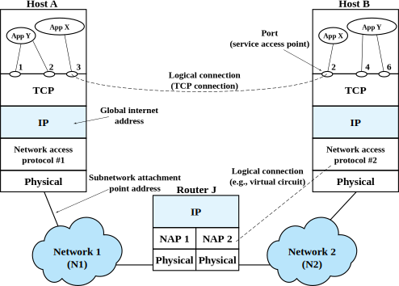

# Programming with Python Sockets

In this tutorial, you will learn how to use the socket API to transfer data across a network. This version of the tutorial uses Python sockets. It should take you about 90-120 minutes to work through this tutorial.

You can run this experiment on CloudLab or on FABRIC.

Before you can run an experiment on either of these facilities, you will need to set up an account and join a project under the supervision of a research advisor or a course instructor. If you are going to use CloudLab but you haven't set up your CloudLab account yet, follow the instructions in [Hello, CloudLab](https://teaching-on-testbeds.github.io/hello-cloudlab/) to do so. If you are going to use FABRIC but you haven't set up your FABRIC account yet, follow the instructions in [Hello, FABRIC](https://teaching-on-testbeds.github.io/hello-fabric) to do so.

## Background: the socket API

The image below shows a "logical connection" between an application, App X, on a host named Host A, and an application, App X, on another host named Host B. 


_Image from William Stallings, "Data and Computer Communications"_

These hosts are on different networks, and all of the layers of the TCP/IP protocol stack are involved in transferring data across this "logical connection". When App X on Host A has data to send, it will be transferred down the network protocol stack; across Network 1; through Router J; across Network 2; and up the protocol stack on Host B until it reaches App X. However, these details are hidden from the application: as far as each application is concerned, it can directly send and receive data across this "logical connection".

This is enabled by the **socket API**! The socket API is a programming interface that connects the application layer to the transport layer and from there, the rest of the TCP/IP protocol stack. It manages the various buffers that are used to transfer data between the network protocol stack and the application, and allows the application to use the network just by calling basic, intuitive functions like "send" and "receive".

Since there are two major transport layer protocols - UDP and TCP - there are two ways to use the socket API! In the next section, we will describe the steps involved in sending and receiving data over a UDP socket, and in the following section, we will describe the steps involved in sending and receiving data over a TCP socket.

### UDP sockets

UDP is a very simple transport protocol. It adds a small header to the payload, then sends it directly to a target host, without establishing a connection first. This is in contrast to the other major transport protocol, TCP, which is a connection-oriented protocol.

This makes UDP very easy to use!

To *send* data with UDP, an application should:

1. Create a UDP socket
2. (Optional) `bind` to the *local* IP address and UDP port that the socket should use. (If you don't choose a port, the operating system will select a random large port number for you when you first try to send data.)
3. `send` data, by specifying the data to send and the *destination* IP address and port.

To *receive* data, an application should:

1. Create a UDP socket
2. `bind` to the *local* IP address and UDP port that the socket should use.
3. `receive` data from the socket *buffer*, where the operating system will have put any data that was passed up the network protocol stack for this UDP port.

Later in this exercise, we will execute each of these steps, and observe their effect on the operating system and on the network. We'll also trigger some common UDP socket API errors (on purpose!) so that we can understand what causes them and what they mean.


### TCP sockets

TCP sockets have a few more steps, because unlike UDP, TCP is a connection-oriented protocol. Therefore, the TCP socket API also includes functions for establishing a connection and for closing a connection.

Any data transfer with TCP starts with **connection establishment**. Of the two communication endpoints, one will `listen` for incoming connections and the other will use `connect` to initiate the connection. The host that listens is known as the *server*, and the host that initiates the connection is called the *client*.

First, the server should:

1. Create a TCP socket.
2. `bind` to the *local* IP address and TCP port that the socket should use, and `listen` for incoming connections on the socket.
3. Call `accept`, which won't send anything over the network, but will wait until there is an incoming connection. When a connection is initiated by the client, `accept` will spin off a *new* socket which will be used for the connection to this host.

The client will then:

1. Create a TCP socket.
2. (Optional) The client may `bind` to the *local* IP address and TCP port. This is optional - if there is no explicit call to `bind`, the operating system will assign a random TCP port to this socket in the next step.
3. Call `connect`, specifying the *destination* IP address and port. This instructs the TCP transport layer to execute the connection establishment process, which involved sending messages known as the "three-way handshake" between client and server.

Once connection establishment is complete, and the connection is ongoing, the client and server applications can use two more socket API calls to transfer data:

1. `send` to put data into the send socket buffer, from which the operating system will stream data across the connection. The data segment will be delivered to the receive socket buffer at the other endpoint. 
2. `recv` to read data from the receive socket buffer.


Finally, the client or server can use the `shutdown` socket API call to indicate that it wants to close the connection.

Later in this exercise, we will execute each of the socket API calls involved in TCP connection establishment, data transfer, and shutdown, and observe their effect on the operating system and on the network. We'll also trigger some common TCP socket API errors (on purpose!) so that we can understand what causes them and what they mean.

## Run my experiment

Now that you know all about sockets, you are ready to set up a network of hosts and use the socket API to exchange data among them!

You will run this experiment on either CloudLab or FABRIC - follow the instructions for whichever facility you are using.

### Reserve and log in to resources on CloudLab

For this experiment, we will use the CloudLab profile available at the following link: [https://www.cloudlab.us/p/cl-education/sockets-python](https://www.cloudlab.us/p/cl-education/sockets-python)

If you visit this link, you'll see a brief description of the profile. Click "Next". On the following page, you'll see a diagram of your experiment topology (on the right - in this case, two hosts connected to a common network), and on the left you'll be asked to select the "Cluster" on which you want your experiment to run.

This experiment can run on any cluster. However, since CloudLab is a shared resource, on some occasions the cluster you select might not have enough available resources to support your experiment. The status indicator next to each cluster tells you roughly how heavily utilized it is at the moment - green indicates that there are not many users, orange means heavy load, and red means that it is almost fully utilized. You are more likely to be successful if you choose a cluster with a green indicator.

After you select a cluster, you can leave the "Name" field blank, or give your experiment a name - it's your choice. Also make sure your "Project" is selected. Then, click "Next".

On the last page, you'll be asked to set the duration of your experiment. At the end of this duration, your resources will be deleted automatically - so make sure to give yourself enough time to finish.

You can leave the start date/time on this page blank if you are ready to work on the experiment right now. 

When you have made all your choices, click "Finish" to ask CloudLab to reserve resources according to your configuration.

Once you have successfully instantiated a profile, it will still take some time before your resources are ready for you to log in.

As your resources come online, you'll see their progress on the CloudLab experiment page. Once each host in your experiment is "green" and has a "✓" icon in the top right corner, it is ready for you to log in! 

For this experiment, you will need a terminal session on the "romeo" and "juliet" hosts. You can use any method you prefer:

* Open an SSH session using the terminal in the CloudLab web portal
* Open an SSH session using a terminal application that is installed on your laptop or PC
* Open a VNC session (for a graphical interface)

(You can refer back to the [Hello, CloudLab](https://teaching-on-testbeds.github.io/hello-cloudlab/) experiment, if you don't remember how to open a terminal session or a VNC session!)

### Reserve and log in to resources on FABRIC

If you are using FABRIC, open a terminal in the FABRIC Jupyter environment, and run

```
git clone https://github.com/teaching-on-testbeds/sockets-python.git
```

Then, open the `start_here_fabric.ipynb` notebook inside the `sockets-python` directory that will appear in your file browser. Use it to reserve resources for the experiment.

### Network configuration

Run

```
ip addr
```

on each host, "romeo" and "juliet", and make a note of their respective IPv4 addresses. You should see that "romeo" has an interface that uses the IPv4 address 10.10.0.100, and "juliet" has an interface that uses the IPv4 address 10.10.0.101.

### Transfer data across UDP sockets

From the terminal on the "romeo" host, run

```
python3
```

to open an interactive Python terminal. Then, do the same on "juliet". Your prompt (on both hosts) will now look like this:

```
>>> 
```

indicating that you are working in the Python terminal.

On "juliet", run


```python
import socket

sock = socket.socket(socket.AF_INET, socket.SOCK_DGRAM) 
```

in the Python terminal, to create a UDP socket. (Note that the argument `socket.SOCK_DGRAM` specifies the type as a UDP socket.) 

This doesn't send any data over the network - it just sets up the local data structures that will keep information about this socket.

Next, on "juliet", run


```python
sock.bind(('10.10.0.101', 4000))
```

in the Python terminal, to `bind` this socket to an IP address and port. Note that `10.10.0.101` is "juliet"'s *own* IP address, and `4000` is an unused UDP port on "juliet". (Any unused port number will work!)


The `bind` socket API function also does not send any data across the network, but it *does* "reserve" this IP address - port combination for this socket, so no other application can use it.

Just for fun, let's see what would happen now if another socket tries to use that IP address and port. In the Python terminal on "juliet", run

```python
sock2 = socket.socket(socket.AF_INET, socket.SOCK_DGRAM) 
sock2.bind(('10.10.0.101', 4000))
```

to create a second socket, and try to `bind` it to the *same* local IP address and UDP port. You will see an error message

```
OSError: [Errno 98] Address already in use
```

indicating that the second socket cannot bind to this IP address and port, because your first socket already "reserved" it! However, you *can* use another port number:

```python
sock2.bind(('10.10.0.101', 4001))
```

should run without any problem.


Next, we'll see what happens when an application tries to send to a process that is *not* "receiving" yet.

On "juliet", run

```python
sent = sock.sendto(b'Hello', ('10.10.0.100', 5000))
print(sent)
```

in the Python terminal. This command will place the message (`Hello` in this example) in the send buffer; the TCP/IP protocol stack in the operating system will take over from there, and send the data across the network to the destination IP address (`10.10.0.100`, which is "romeo") and port number (`5000` here). 

The `sendto` command returns the number of bytes that were placed in the socket send buffer, for the operating system to send, and then we print this value. 

* Note that this *not* necessarily the number of bytes that are actually sent! It's possible for some data to be placed into the socket send buffer, but not be sent (for example, if the sending host becomes disconnected from the network). 
* It's also *not* necessarily the number of bytes received at the other end. In this case, we haven't set up any socket to receive the message on "romeo", so the message will be sent, but not received. 

Now we are ready to *successfully* transfer data across the UDP socket! Leave your Python terminal on "juliet" open, with the `sock` socket still in scope. In the Python terminal on "romeo", run

```python
import socket

sock = socket.socket(socket.AF_INET, socket.SOCK_DGRAM) 
sent = sock.sendto(b'Hello', ('10.10.0.101', 4000))
```

This will send the message `Hello` to the *destination* IP address and port number specified (`10.10.0.101`, `4000`). We did not call `bind` on "romeo"'s socket, so the host operating system will automatically assign it an available port number.

Since "juliet" has *bound* a socket to that IP address and port (`10.10.0.101`, `4000`), when the message is received, the network protocol stack in "juliet"'s operating system will pass it up the stack and place it in the receive buffer associated with that socket. 

To see it, in the Python terminal on "juliet", run

```python
data, addr = sock.recvfrom(1024)
```

to receive up to 1024 bytes from the socket receive buffer. Since there is a message in the socket receive buffer, this function will remove it from the buffer and return immediately. (If the socket receive buffer was empty, this function would block and not return until something was received.) 

The contents of the message will be placed in `data` - try

```python
print(data)
```

The IP address and UDP port number of the host that sent this message will be in `addr` - try

```python
print(addr)
```

We can also transfer data in the other direction, from "juliet" to "romeo"! On "juliet", try

```python
sock.sendto(b'O Romeo, Romeo, wherefore art thou Romeo?', addr)
```

Then, on "romeo", run

```python
data, addr = sock.recvfrom(1024)
print(data)
```

to see the message.

When you are finished experimenting with your UDP sockets, use

```python
quit()
```

in both Python terminals to close the interactive Python session and return to the regular terminal prompt on the two hosts.

### Transfer data across TCP sockets


From the terminal on the "romeo" host, run

```
python3
```

to open an interactive Python terminal. Then, do the same on "juliet". Your prompt (on both hosts) will now look like this:

```
>>> 
```

indicating that you are working in the Python terminal.

We are going the make "juliet" the server (the one that calls `listen`) and "romeo" the client (the one that initiates the connection) in this exchange.

On "juliet", run


```python
import socket

sock = socket.socket(socket.AF_INET, socket.SOCK_STREAM) 
```

in the Python terminal, to create a TCP socket. (Note that the argument `socket.SOCK_STREAM` specifies the type as a TCP socket. The UDP socket in the previous section was a `socket.SOCK_DGRAM` type.) 

This doesn't send any data over the network - it just sets up the local data structures that will keep information about this socket.

Next, on "juliet", run


```python
sock.bind(('10.10.0.101', 4000))
```

in the Python terminal, to `bind` this socket to an IP address and port. Note that `10.10.0.101` is "juliet"'s *own* IP address, and `4000` is an unused TCP port on "juliet". (Any unused port number will work!)

The `bind` socket API function also does not send any data across the network, but it *does* "reserve" this IP address - port combination for this socket, so no other application can use it.

Just for fun, let's see what would happen now if another socket tries to use that IP address and TCP port. In the Python terminal on "juliet", run

```python
sock2 = socket.socket(socket.AF_INET, socket.SOCK_STREAM) 
sock2.bind(('10.10.0.101', 4000))
```

to create a second socket, and try to `bind` it to the *same* local IP address and TCP port. You will see an error message

```
OSError: [Errno 98] Address already in use
```

indicating that the second socket cannot bind to this IP address and TCP port, because your first socket already "reserved" it! This is just like the UDP example in the previous section.

At this point in the UDP experiment, we tried to send data across the connection, to see what would happen if the second endpoint was not yet ready to receive data. (There was no warning or error message from the UDP socket - it just quietly sent the message, to be discarded by the receiving operating system.) 

However, since TCP is a connection-oriented protocol, we will do things a little bit differently here - we will try to establish a *connection* when the server is not yet "listening" for incoming connections, just to see what happens.

Leave your Python process running on "juliet", with the socket still in scope. In the Python terminal on "romeo", run

```python
import socket

sock = socket.socket(socket.AF_INET, socket.SOCK_STREAM) 
```

and then 

```python
sock.connect(('10.10.0.101', 4000))
```

to create a TCP socket, and instruct the transport layer to try to establish a connection with "juliet" (specifying the IP address and TCP port number that "juliet"'s socket is *bound* to). We did not *bind* the socket on "romeo", so the operating system will assign a random unused TCP port to this socket.

This command will return an error

```
ConnectionRefusedError: [Errno 111] Connection refused
```

Since unlike UDP, TCP is *connection oriented*, it can (and does!) let us know about the state of the other endpoint in the connection. In this case, the connection is not established because "juliet" was not yet *listening* for an incoming connection. Let's rectify that now - in the Python terminal on "juliet", run

```python
sock.listen()
```

Now "juliet" is ready to receive incoming connections, so on "romeo", run

```python
sock.connect(('10.10.0.101', 4000))
```

again. This time, the connection establishment process should succeed, and there will be no error message.

In order to send or receive data over the connection, though, "juliet" must `accept` it. In the Python terminal on "juliet", run

```python
conn_sock, conn_addr = sock.accept()
```

This "spins off" a *new* socket - in `conn_sock`, with the address and port of the other endpoint in `conn_addr` - specifically for this connection. The original `sock` on "juliet" stays in the "listening" state and can still accept connections from *other* hosts.

Now that the connection is established, either endpoint can send data across it.

In the Python terminal on "romeo", try 

```python3
sock.send(b"But, soft! what light through yonder window breaks?")

```

This command will place the message in the send buffer; the TCP/IP protocol stack in the operating system will take over from there, and send the data across the network to the destination IP address associated with the TCP socket. 

(Since we called `connect` and specified the IP address and port number of the other endpoint of this socket, we don't need to specify it as part of the `send` command, like we did in UDP. In fact, in UDP, the same socket can be used to send data to more than one destination; but in TCP, a client socket can only send to the destination that it has `connect`ed to.)

The `send` command returns the number of bytes that were placed in the socket send buffer, for the operating system to send, and then we print this value. 

* Note that if we try to place a lot of data into the socket send buffer, the `send` command may return a smaller value than expected, indicating that only some of the data was accepted into the socket buffer. (For example, if there is not enough room in the socket buffer for all of the data.) In that case, we will need to wait for some data to be sent from the buffer, freeing up space, and try again to `send` the data that was not accepted before.
* It's also *not* necessarily the number of bytes received at the other end. Although TCP is considered a "reliable" communication protocol, it's still not guaranteed that the receiving application will see this data. (For example, if we would close the socket on "juliet" now without ever retrieving the message from the socket receive buffer.)

Leave your Python terminal on "romeo" open. In the Python terminal on "juliet", run


```python
data = conn_sock.recv(1024)
```

to receive up to 1024 bytes from the socket receive buffer. Since there is a message in the socket receive buffer, this function will return immediately. (If the socket receive buffer was empty, it would block until something was received.)

The contents of the message will be placed in `data` - try

```python
print(data)
```

to see it.

Note that on the server, the data is tranferred using the connected `conn_sock`, not the original `sock` socket which is still listening for incoming connections. If you would try to receive on that socket:

```python
data = sock.recv(1024)
```

you would get the error message:

```
OSError: [Errno 107] Transport endpoint is not connected
```

We can also send data in the opposite direction, from "juliet" to "romeo". In the Python terminal on "juliet", run


```python
conn_sock.send(b"What's in a name? that which we call a rose by any other name would smell as sweet")
```

and then in the Python terminal on "romeo", run

```python
data = sock.recv(1024)
print(data)
```
to see the message.

When "romeo" and "juliet" are finished talking, they will close the connection. Either side can initiate the shutdown, but we'll do it on "romeo". 

In the Python terminal on "romeo", run

```python
sock.shutdown(socket.SHUT_RDWR)
```

Then, in the Python terminal on "juliet", run

```python
conn_sock.shutdown(socket.SHUT_RDWR)
sock.close()
```

Now you can use

```python
quit()
```

in both Python terminals to close the interactive Python session and return to the regular terminal prompt on the two hosts.


## Exercise

Write a Python application on "romeo" and "juliet" to exchange the following dialogue between the two hosts:

```text
ROMEO

    She speaks:
    O, speak again, bright angel! for thou art
    As glorious to this night, being o'er my head
    As is a winged messenger of heaven
    Unto the white-upturned wondering eyes
    Of mortals that fall back to gaze on him
    When he bestrides the lazy-pacing clouds
    And sails upon the bosom of the air.

JULIET
    O Romeo, Romeo! wherefore art thou Romeo?
    Deny thy father and refuse thy name;
    Or, if thou wilt not, be but sworn my love,
    And I'll no longer be a Capulet.
```


To write Python code, you can either:

* use `nano` or any other terminal-based text editor in the terminal on the host, or
* (if you are using CloudLab) in the VNC session on either host, run `leafpad` in the terminal to open a graphical text editor.

Save your Python code using your preferred editor on "romeo" and "juliet" - for example, as `balcony.py`. Then, to test it, in the terminal on the remote host run

```bash
python3 balcony.py
```

Print each line of dialogue as it is sent and received at each host, and verify that the entire message is transferred correctly.

See if you can write both a UDP and TCP version of this code!

## Release resources

When you are finished with this experiment, make sure to delete your resources and free them for other experimenters.


---

<small>Questions about this material? Contact Fraida Fund</small>

---

<small>This material is based upon work supported by the National Science Foundation under Grant No. 2231984.</small>
<small>Any opinions, findings, and conclusions or recommendations expressed in this material are those of the author(s) and do not necessarily reflect the views of the National Science Foundation.</small>
